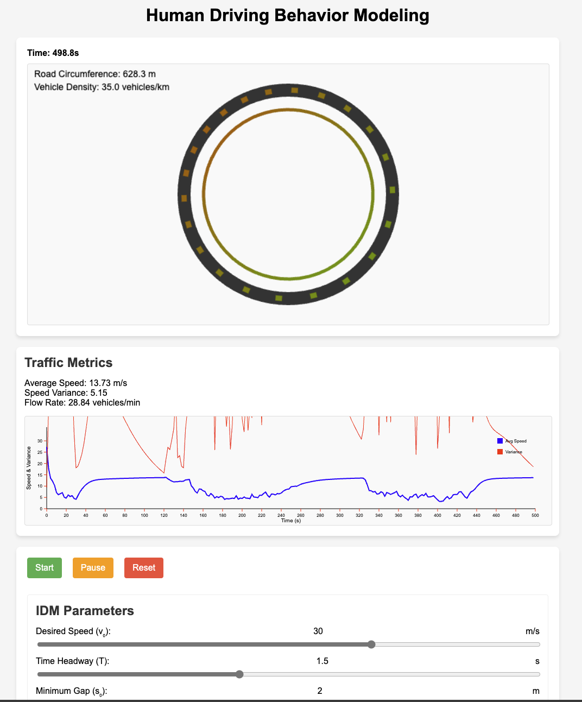

# Human Driver Behavior Modeling Visualizer

A simple visualization tool for academic purposes to explain how imperfections in human driver behaviors can lead to stop-and-go traffic. 

  

Licensed under MIT license. For questions or suggestions, reach out to Vindula Jayawardana (vindula [at] mit [dot] edu)

